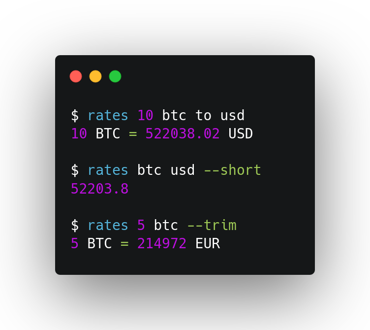

# Rates

Rates is a scriptable CLI tool that brings currency exchange rates right into your terminal and supports 30+ fiat and 10K+ crypto currencies.

## Installation
### [Cargo](https://crates.io/crates/rates)
```sh
cargo install rates
```

### [pkgsrc](https://pkgsrc.se/finance/rates)
```sh
pkgin install rates
```

### [AUR](https://aur.archlinux.org/packages/rates-git/)
```sh
paru -Syu rates-git
```

### [Releases](https://github.com/lunush/rates/releases)
Alternatively, you can download a binary for your system from the
[releases](https://github.com/lunush/rates/releases) page

## License
Apache 2.0 or MIT, at your option.
